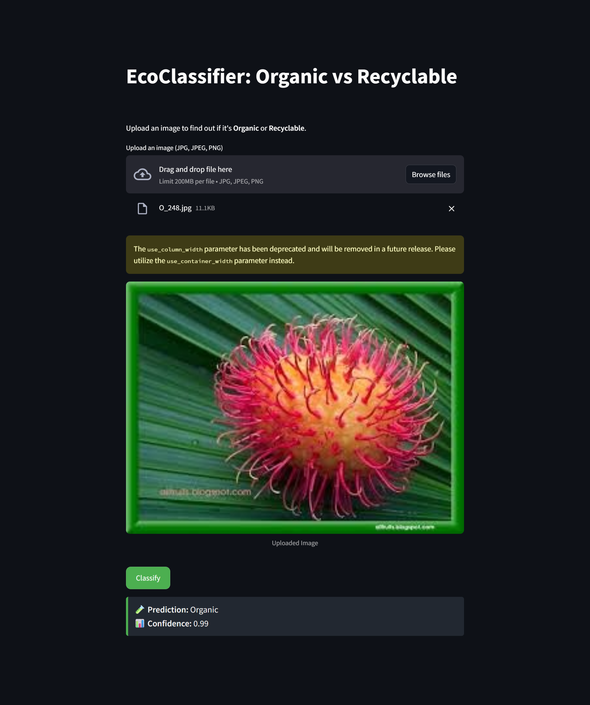
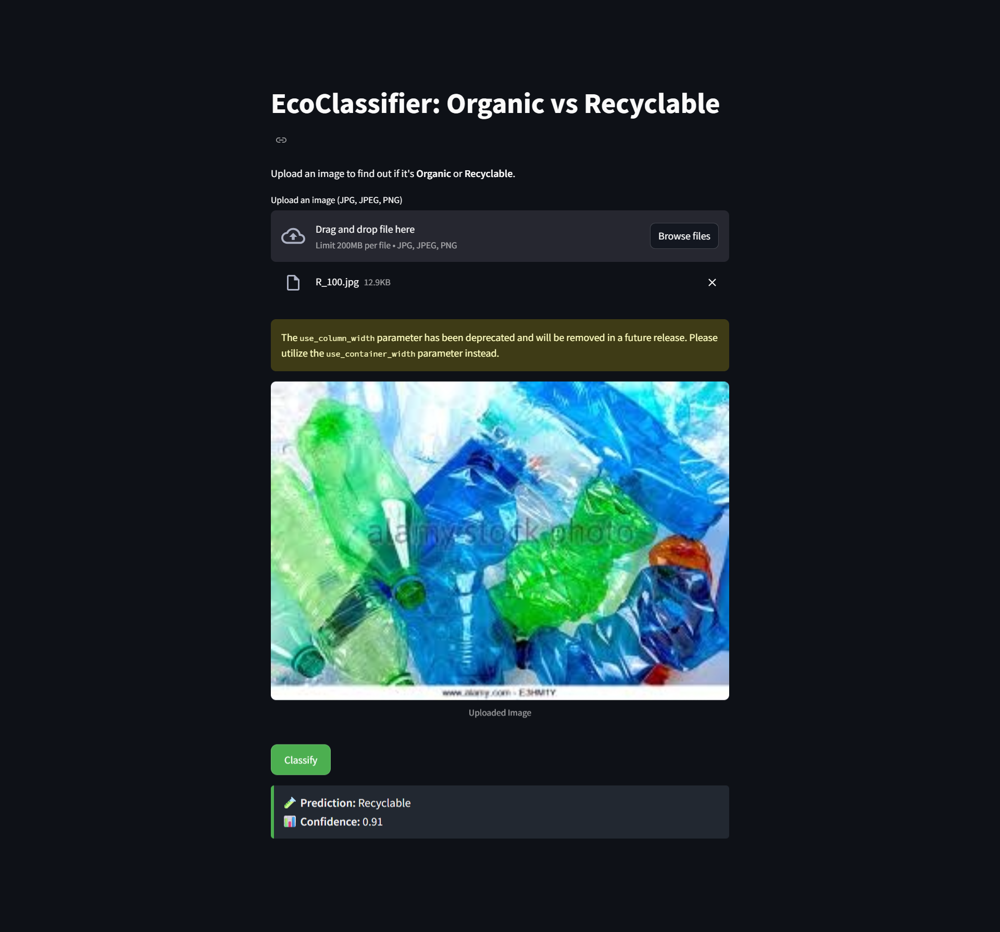

# ♻️ EcoClassifier: Organic vs Recyclable

This project is a deep learning-based image classifier that can detect whether a piece of trash is **Organic** (e.g., food waste) or **Recyclable** (e.g., plastic bottles). It uses a Convolutional Neural Network (CNN) trained using TensorFlow/Keras.

---

## 📌 Features

- Classifies trash images as **Organic** or **Recyclable**.
- Upload image and get predictions via CLI or Web App.
- Simple to train, test, and run.

---

## 🖼️ Screenshot

<p align="center">
  
&nbsp;
  
</p>

---

### Project Structure
```
eco-classifier/
│
├── app.py                         # Streamlit app script
├── recyclable_vs_organic.h5       # Trained model
├── Organic_Recyclable.ipynb       # Training notebook
├── requirements.txt
├── README.md
└── screenshots/

```

## 🚀 Getting Started (Step-by-Step Instructions)

These steps will help you set up the project **from scratch** on your local machine.

---

### ✅ 1. Clone the Repository

```bash
git clone https://github.com/your-username/eco-classifier.git
cd eco-classifier
```

### ✅ 2. Create and Activate Virtual Environment 
```
python -m venv venv
venv\Scripts\activate
```

### ✅ 3. Install All Dependencies
```
pip install -r requirements.txt
```
### ✅ 4. Train the Model (If you want to retrain)
You can skip this if you're using the already trained .h5 model.

# 1.Open the notebook:
  `Organic_Recyclable.ipynb`

# 2.Ensure your dataset structure looks like this:
```
dataset/
├── train/
│   ├── Organic/
│   └── Recyclable/
└── test/
    ├── Organic/
    └── Recyclable/
```
# 3.Upload images to appropriate folders.

# 4.Run all notebook cells.

# 5.Save the model (e.g., recyclable_vs_organic.h5).

### ✅ 5.Run the app.py using streamlit:
```
streamlit run app.py
```
